# AI Investment Decision Support Platform Design Document

## 1. Purpose and Product Direction

This project is a production-style AI investment decision support platform. It combines retrieval-augmented generation, quantitative forecasting, structured signal extraction, and explainable aggregation to help users reason about public companies using traceable evidence.

The system is not intended to provide personalized financial advice, execute trades, or predict exact stock prices. Its purpose is to synthesize qualitative and quantitative evidence into transparent research artifacts that show what evidence supports a bullish, neutral, or bearish view.

The MVP will focus on the top 10 companies in the S&P 500 by index weight. That scope is large enough to demonstrate realistic market analysis while keeping ingestion, retrieval, forecasting, and evaluation manageable for an initial portfolio-quality build.

## 2. Goals and Non-Goals

### Goals

- Build a local-first AI application that can be run and evaluated reproducibly.
- Demonstrate modern AI engineering practices across RAG, forecasting, LLM orchestration, evaluation, and software design.
- Provide cited company research over financial documents and structured market data.
- Produce interpretable investment outlooks with evidence, confidence scores, and component-level reasoning.
- Support notebook-driven experimentation before promoting reusable logic into production modules.
- Organize implementation into meaningful GitHub branch chapters that tell a clear project story.

### Non-Goals

- Automated trading or order execution.
- Personalized investment advice.
- Guaranteed stock price prediction.
- Full S&P 500 coverage in the MVP.
- Cloud-scale infrastructure before the local-first system is working.
- Notebook-only workflows that bypass tested package code.

## 3. MVP Scope

The MVP should support the top 10 S&P 500 companies by index weight through a configurable ticker universe. The initial implementation may pin a static list, but the data model and configuration should allow future refreshes of constituent weights and membership.

Core MVP capabilities:

- Company overview dashboard for each top-10 company.
- Historical price and volume ingestion.
- Company fundamentals or financial metrics ingestion where available.
- SEC filing and/or earnings transcript ingestion for each company.
- Document parsing, chunking, embedding, retrieval, reranking, and citation tracking.
- Cited RAG question answering over ingested company documents.
- Forecasting baselines using ARIMA or another classical method plus XGBoost.
- Forecast evaluation using metrics such as MAE, RMSE, MAPE, and directional accuracy.
- LLM-based qualitative signal extraction from retrieved evidence.
- Signal aggregation into bullish, neutral, or bearish outlooks with confidence and citations.
- Streamlit UI backed by FastAPI services.
- Evaluation reports for retrieval, LLM grounding, citation quality, and forecasting.

## 4. System Architecture

The system should use a modular Python architecture with clear boundaries between data acquisition, storage, retrieval, modeling, LLM use, aggregation, serving, and UI.

```mermaid
flowchart LR
    Sources["External Data Sources"] --> Ingestion["Ingestion Pipelines"]
    Ingestion --> RawStore["Raw Local Storage"]
    RawStore --> Normalize["Normalization Layer"]
    Normalize --> AnalyticsStore["DuckDB or SQLite"]
    Normalize --> DocumentStore["Document Store"]
    DocumentStore --> Chunking["Chunking Pipeline"]
    Chunking --> Embeddings["Embedding Provider Adapter"]
    Embeddings --> VectorStore["Chroma or LanceDB"]
    AnalyticsStore --> Forecasting["Forecasting Service"]
    VectorStore --> Retrieval["Hybrid Retrieval and Reranking"]
    DocumentStore --> Retrieval
    Retrieval --> SignalExtraction["LLM Signal Extraction"]
    Forecasting --> Aggregation["Signal Aggregation Engine"]
    SignalExtraction --> Aggregation
    AnalyticsStore --> Aggregation
    Aggregation --> API["FastAPI"]
    Retrieval --> API
    Forecasting --> API
    API --> UI["Streamlit UI"]
    API --> Evaluation["Evaluation Reports"]
```

### Major Components

#### Ingestion Layer

The ingestion layer collects external data and writes raw artifacts before normalization. This makes the pipeline auditable and allows parsers to be improved without re-fetching everything.

Initial sources may include:

- Historical prices and volume.
- Company fundamentals and financial ratios.
- SEC filings, especially 10-K and 10-Q filings.
- Earnings call transcripts if a reliable source is available.
- Index weights or a static top-10 S&P 500 configuration.

Future sources may include major financial news, investor presentations, macroeconomic indicators, and Federal Reserve announcements.

#### Storage Layer

The MVP should be local-first.

- Use DuckDB or SQLite for structured local analytics data.
- Use the filesystem for raw documents and intermediate artifacts.
- Use Chroma or LanceDB for local vector search.
- Keep identifiers stable across raw documents, normalized records, chunks, embeddings, extracted signals, forecasts, and reports.

DuckDB is preferred if analytical queries over price history, fundamentals, and evaluation outputs become central. SQLite is acceptable if simplicity is more important early in the scaffold.

#### Retrieval Layer

The retrieval pipeline should prioritize transparency and citation quality.

Key responsibilities:

- Parse source documents into normalized text and metadata.
- Chunk documents using a configurable chunk size and overlap.
- Generate embeddings through an embedding provider adapter.
- Store chunks, embeddings, and metadata in the vector store.
- Support keyword search, dense vector search, and eventually hybrid retrieval.
- Rerank candidate chunks before passing evidence to the LLM.
- Return retrieval results with document IDs, chunk IDs, source metadata, timestamps, and citation spans where possible.

#### LLM and Embedding Layer

LLM and embedding providers should be accessed through interfaces rather than direct calls from application logic.

Provider adapters should support:

- Text generation.
- Structured extraction.
- Embedding generation.
- Model metadata capture.
- Token usage and latency reporting where available.

The MVP can use whichever provider is easiest to configure locally, but application code should not assume a single vendor. Future adapters may support OpenAI, Anthropic, local embedding models, or open-weight generation models.

#### Forecasting Layer

The forecasting layer should start with strong baselines before adding transformer-based forecasting.

MVP models:

- Classical baseline such as ARIMA, exponential smoothing, or a simple moving-average baseline.
- XGBoost model using engineered lag, rolling, momentum, volatility, calendar, and market-context features.

Later forecasting work:

- Chronos, TimesFM, PatchTST, or another transformer-based time-series model.
- Backtesting utilities shared across baseline and transformer approaches.
- Model comparison reports that show whether more complex models add value.

The target should not be perfect price prediction. The forecasting module should demonstrate disciplined model development, backtesting, error analysis, and explainability.

#### Signal Extraction Layer

The signal extraction layer converts retrieved qualitative evidence into structured records. The LLM should extract signals, not directly decide whether to buy or sell.

Initial signal categories:

- Management sentiment.
- Forward guidance.
- Revenue and EPS outlook.
- Capital expenditure and AI investment.
- Regulatory or litigation risk.
- Supply chain risk.
- Macroeconomic exposure.
- Valuation context.
- Momentum and technical trend.
- Earnings quality.

Each extracted signal should include a category, direction, confidence score, rationale, citations, and model metadata.

#### Aggregation Layer

The aggregation engine combines independent qualitative and quantitative signals into an interpretable investment outlook.

Each component signal should map to:

- Bullish.
- Neutral.
- Bearish.

The aggregate outlook should include:

- Overall direction.
- Overall confidence.
- Component scores.
- Explanation of major drivers.
- Explicit risks and counterpoints.
- Supporting citations.
- Forecast summaries and evaluation context.

The aggregation method should begin with transparent rule-based weighting. More complex learned aggregation can be explored later only after enough labeled evaluation data exists.

#### API Layer

FastAPI should expose application capabilities to the UI and to tests.

Initial endpoint groups:

- Company metadata and overview.
- Financial metrics and historical price summaries.
- Document search and RAG answers.
- Forecast generation and forecast summaries.
- Extracted signals.
- Aggregated outlooks.
- Evaluation runs and reports.

The API should return structured JSON with stable IDs and citation metadata so the UI can render evidence without parsing LLM prose.

#### UI Layer

Streamlit should provide the first user-facing application experience.

Initial views:

- Dashboard.
- Company Overview.
- Financial Forecasts.
- Retrieved Evidence.
- SEC Filings or Document Explorer.
- Earnings and Risk Analysis.
- Investment Outlook.
- RAG Chat.

The UI should make citations visible and should separate evidence, model outputs, and final synthesized outlooks.

## 5. Data Flow

The core data flow should be:

1. Load the configured top-10 S&P 500 ticker universe.
2. Collect raw price, volume, fundamental, filing, and transcript data.
3. Store raw source artifacts locally with source metadata.
4. Normalize structured data into analytics tables.
5. Parse documents into normalized text records.
6. Chunk document text and attach ticker, filing type, date, source, and section metadata.
7. Generate embeddings for chunks and index them in the vector store.
8. Retrieve relevant chunks using dense, keyword, or hybrid search.
9. Rerank retrieved evidence and assemble citation-ready context.
10. Run LLM-based structured signal extraction over retrieved evidence.
11. Generate quantitative forecasts and forecast evaluation metrics.
12. Aggregate qualitative signals, quantitative forecasts, fundamentals, and technical indicators.
13. Serve company research, citations, forecasts, and outlooks through FastAPI.
14. Render interactive workflows in Streamlit.
15. Run retrieval, LLM, citation, and forecasting evaluations.

## 6. Core Data Contracts

The exact implementation may use Pydantic models, dataclasses, or typed dictionaries, but the system should preserve these conceptual records.

### Company

- `company_id`
- `ticker`
- `name`
- `sector`
- `industry`
- `index_weight`
- `is_active`
- `as_of_date`

### Document

- `document_id`
- `company_id`
- `ticker`
- `source_type`
- `source_url`
- `title`
- `published_at`
- `filing_type`
- `raw_path`
- `normalized_text_path`
- `metadata`

### DocumentChunk

- `chunk_id`
- `document_id`
- `company_id`
- `ticker`
- `chunk_index`
- `text`
- `section`
- `start_char`
- `end_char`
- `embedding_id`
- `metadata`

### RetrievalResult

- `query`
- `chunk_id`
- `document_id`
- `ticker`
- `score`
- `rank`
- `retrieval_method`
- `text`
- `citation`
- `metadata`

### ForecastResult

- `forecast_id`
- `company_id`
- `ticker`
- `target`
- `model_name`
- `train_window`
- `forecast_horizon`
- `predictions`
- `metrics`
- `created_at`
- `metadata`

### ExtractedSignal

- `signal_id`
- `company_id`
- `ticker`
- `category`
- `direction`
- `confidence`
- `rationale`
- `citations`
- `source_chunk_ids`
- `model_name`
- `created_at`

### InvestmentOutlook

- `outlook_id`
- `company_id`
- `ticker`
- `overall_direction`
- `overall_confidence`
- `component_scores`
- `summary`
- `supporting_evidence`
- `risks`
- `counterpoints`
- `forecast_refs`
- `created_at`

## 7. Technology Choices

### Backend and Application

- Python for all core application code.
- FastAPI for API serving.
- Pydantic for schemas and validation.
- Streamlit for the MVP user interface.
- Docker for reproducible local runtime.
- GitHub Actions for CI.

### Data and Retrieval

- DuckDB or SQLite for local structured storage.
- Chroma or LanceDB for local vector search.
- Filesystem storage for raw documents, normalized text, and generated reports.
- pandas and pyarrow where useful for tabular processing.

### Machine Learning and Forecasting

- pandas, numpy, scikit-learn for feature engineering and evaluation.
- statsmodels or pmdarima for ARIMA-style baselines.
- XGBoost for tabular forecasting baselines.
- Chronos, TimesFM, PatchTST, or equivalent transformer-based models as a later branch.

### LLM and Evaluation

- Provider adapter interfaces for LLMs and embeddings.
- Structured extraction using Pydantic-compatible schemas.
- Retrieval metrics including Recall@k, Precision@k, MRR, and nDCG.
- LLM metrics including groundedness, faithfulness, hallucination rate, citation accuracy, latency, and token cost.
- Forecasting metrics including MAE, RMSE, MAPE, and directional accuracy.

## 8. Notebook Workflow

The repository should include a `notebooks/` subfolder as the experimental companion to production code. Each major component should first be explored or validated in notebooks, then promoted into tested package modules.

Planned notebooks:

- `01_data_acquisition.ipynb`: validate top-10 ticker configuration, price data, fundamentals, and raw source availability.
- `02_document_parsing_chunking.ipynb`: inspect SEC or transcript parsing, chunk sizes, overlap, and metadata quality.
- `03_retrieval_experiments.ipynb`: compare embedding choices, keyword search, dense retrieval, hybrid retrieval, and reranking.
- `04_forecasting_baselines.ipynb`: test ARIMA or classical baselines and XGBoost using consistent backtesting windows.
- `05_signal_extraction.ipynb`: prototype structured qualitative extraction prompts and schemas.
- `06_signal_aggregation.ipynb`: validate scoring, confidence, citations, and explanation assembly.
- `07_transformer_forecasting.ipynb`: later exploration of Chronos, TimesFM, PatchTST, or similar models.

Notebook rules:

- Use small reproducible samples.
- Keep reusable business logic in package code, not notebooks.
- Treat notebooks as exploration, diagnostics, and portfolio narrative.
- Add smoke checks or lightweight execution tests for important notebooks where feasible.

## 9. GitHub Branch Roadmap

Each branch should represent a meaningful chapter of the project and leave the repository in a coherent state.

| Branch | Chapter | Deliverables |
| --- | --- | --- |
| `codex/01-project-scaffold` | Project scaffold | Python package layout, config, Docker, linting, tests, CI, initial docs. |
| `codex/02-data-ingestion` | Structured data ingestion | Top-10 S&P 500 config, price and fundamental ingestion, raw and normalized local storage. |
| `codex/03-document-pipeline` | Document processing | SEC or transcript ingestion, parsing, chunking, document metadata, and local document storage. |
| `codex/04-rag-retrieval` | Retrieval system | Embeddings, vector store, keyword or hybrid retrieval, reranking, citation-ready retrieval API. |
| `codex/05-forecasting-baselines` | Forecasting baselines | ARIMA or classical baseline, XGBoost model, backtesting, metrics, and forecasting notebooks. |
| `codex/06-signal-extraction` | Qualitative signals | LLM provider adapters, structured extraction schemas, signal validation, and citation capture. |
| `codex/07-signal-aggregation` | Outlook engine | Bullish, neutral, bearish scoring, confidence logic, explanation assembly, and company outlooks. |
| `codex/08-streamlit-ui` | User interface | Dashboard, company overview, forecasts, evidence viewer, risk summary, and outlook page. |
| `codex/09-evaluation-framework` | Evaluation | Retrieval, LLM, citation, latency, cost, and forecasting evaluation reports. |
| `codex/10-transformer-forecasting` | Advanced forecasting | Transformer-based forecasting notebook and optional production integration. |
| `codex/11-market-outlook-stretch` | Market outlook | Weighted top-10 or broader S&P 500 market outlook and company comparison workflows. |

## 10. Testing and Evaluation Strategy

### Unit Tests

- Schema validation.
- Ticker universe configuration.
- Ingestion normalization.
- Document parsing and chunking.
- Retrieval result formatting.
- Provider adapter behavior using test doubles.
- Forecast metrics.
- Signal scoring and aggregation.

### Integration Tests

- Structured ingestion to local analytics storage.
- Document ingestion to chunk storage.
- Chunking to embeddings to retrieval.
- Retrieval to cited RAG answer.
- Forecast training to forecast result.
- Extracted signals to aggregate outlook.

### Notebook Checks

- Lightweight smoke checks for notebooks that validate major workflows.
- Fixed sample inputs to avoid slow or flaky notebook execution.
- Production code should be importable from notebooks rather than copied into them.

### Evaluation Datasets

The project should include small curated evaluation fixtures:

- Questions with expected relevant documents or chunks.
- Known citation examples.
- Forecasting train/test splits.
- Example extracted signals with expected schema validity.

### Metrics

Retrieval:

- Recall@k.
- Precision@k.
- Mean Reciprocal Rank.
- nDCG.

LLM:

- Groundedness.
- Faithfulness.
- Hallucination rate.
- Citation accuracy.
- Latency.
- Token cost.

Forecasting:

- MAE.
- RMSE.
- MAPE.
- Directional accuracy.

## 11. MVP Acceptance Criteria

The MVP is complete when:

- The system supports the configured top-10 S&P 500 company universe.
- At least one structured financial data source is ingested for each company.
- At least one document source is ingested, chunked, embedded, and searchable for each company.
- A user can ask a company research question and receive an answer with citations.
- A user can view at least one forecast per company with evaluation metrics.
- The system extracts qualitative signals from retrieved evidence.
- The aggregation engine produces a bullish, neutral, or bearish outlook with component-level reasoning.
- The Streamlit UI exposes company overview, evidence, forecasts, risks, and outlooks.
- Tests and evaluation reports cover the main retrieval, forecasting, extraction, and aggregation flows.

## 12. Stretch Goals

- Weighted market outlook using top-10 company weights, then broader S&P 500 coverage.
- Multi-step AI agent for comparison workflows, such as comparing Microsoft and Google over the last four quarters.
- News ingestion and event-driven market summaries.
- Portfolio exposure analysis.
- Advanced transformer-based forecasting with Chronos, TimesFM, PatchTST, or similar models.
- Experiment tracking and model registry.
- Cloud deployment with managed storage, queues, and hosted vector search.
- Scheduled data refresh jobs.
- More advanced explainability dashboards for feature importance and signal attribution.

## 13. Implementation Principles

- Keep conclusions traceable to documents, metrics, forecasts, or explicit model outputs.
- Prefer transparent baselines before adding complex models.
- Promote notebook experiments into reusable package code once validated.
- Use provider adapters for LLMs and embeddings.
- Keep local-first workflows reproducible.
- Keep branch chapters small enough to review but substantial enough to tell a project story.
- Make evaluation a first-class feature rather than an afterthought.

